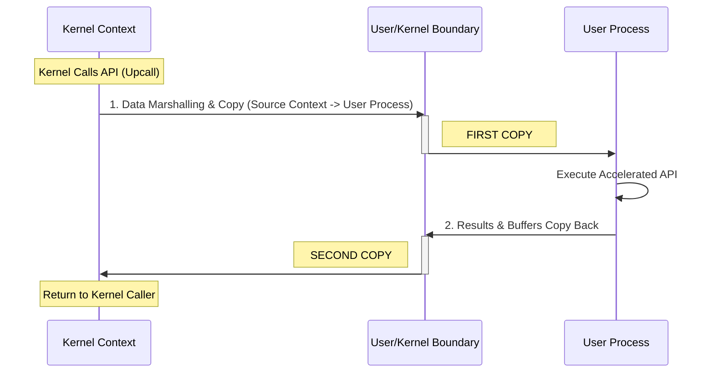

```mermaid {theme: 'neutral', scale: 0.8}
sequenceDiagram
    participant K as Kernel Context
    participant B as User/Kernel Boundary
    participant UP as User Process
    
    Note over K: Kernel Calls API (Upcall)
    
    K->>B: 1. Data Marshalling & Copy (Source Context -> User Process)
    activate B
    Note right of B: FIRST COPY
    B->>UP: 
    deactivate B
    
    UP->>UP: Execute Accelerated API
    
    UP->>B: 2. Results & Buffers Copy Back
    activate B
    Note left of B: SECOND COPY
    B->>K: 
    deactivate B
    
    Note over K: Return to Kernel Caller
```

